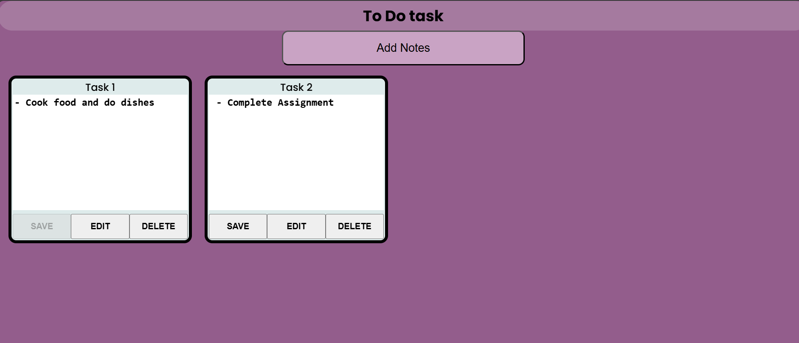

# 📚 Assignment Submission

This repository contains Java and Web Development assignments.

---

## 📌 Project Structure

---

## 💻 Java Assignments

### 1️⃣ **Anagram Check (`anagram.java`)**
- Checks if two strings are anagrams.

### 2️⃣ **Employee Management (`employeeManagement.java`)**
- Implements an `Employee` class and stores employee details in a list.

---

## 🌐 Web Assignments

### 3️⃣ **Responsive Profile Card**
- A profile card with:
  - Profile picture
  - Name & designation
  - Short bio
  - Social media icons
  - CSS animations on hover

---

### 4️⃣ **To-Do List App**
- A simple to-do list using JavaScript and the DOM.
- Features:
  - Add tasks
  - Display tasks
  - Remove tasks

---

### 5️⃣ **Image Slider**
- An image slider using JavaScript.
- Features:
  - Displays one image at a time.
  - Next and Previous buttons.
  - Uses an array of image URLs.

---
